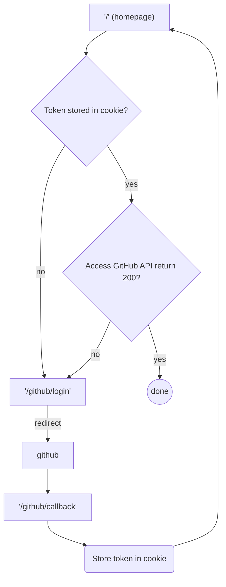

# Login Flow

```mermaid
flowchart TD
    homepage["'/' (homepage)"]
    loginpage["'/github/login'"]
    callbackpage["'/github/callback'"]
    storeCookie(Store token in cookie)
    checkCookie{Token stored in cookie?}
    testAPI{Access GitHub API return 200?}
    done((done))

    homepage --> checkCookie
    checkCookie -->|yes| testAPI
    checkCookie -->|no| loginpage
    loginpage -->|redirect| github --> callbackpage
    callbackpage --> storeCookie --> homepage
    testAPI -->|no| loginpage
    testAPI -->|yes| done
```
